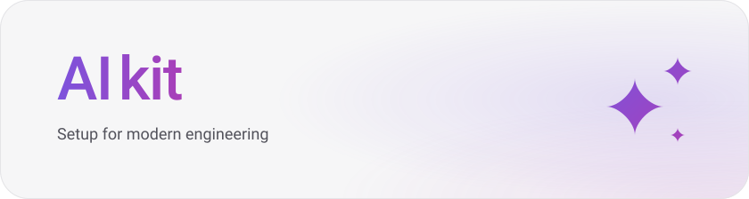
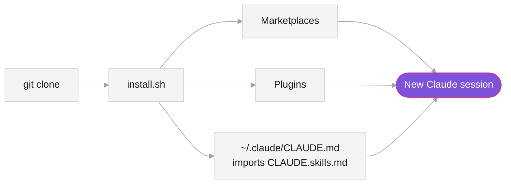

<p align="center">
  <picture>
    <source media="(prefers-color-scheme: dark)" srcset=".github/assets/banner-dark.svg">
    
  </picture>
</p>

<p>
  
  
  <a href="LICENSE.md"></a>
</p>

Plugins that complement each other, one script to install them, one file that settles their overlaps.

##  What's inside

| Zone | Plugin | Adds |
|---|---|---|
| **Design** | `frontend-design` | Visual direction without generic AI defaults |
| | `ui-ux-pro-max` | UX rules, accessibility, stack guidance, style data |
| | `typography` | Quotes, dashes, spacing, figures |
| | `design-audit` | Phased visual audit of an existing app |
| | `bencium-innovative-ux-designer` | Ten directions before a new visual language |
| | `accesslint` | WCAG 2.2 checks on a live page |
| **Motion** | `emil-motion` ✦ | Apple-style physics, animation recipes, motion reviews |
| **Research** | `ux-research` ✦ | Research plans, synthesis, design handoff |
| **Architecture** | [`constitution`](https://github.com/droneey/constitution)  | The blocks and assemblies every droneey repo is built by |
| **Code** | `superpowers` | Workflow skills, calibrated |
| | `security-guidance` | Security checks on edits, commits and pushes |
| | `context7` | Current library docs |
| | `mcp-server-dev` | MCP servers: architecture, auth, packaging |
| **Mobile** | `expo` | Expo and EAS end to end |

<sub>✦ Curated here from an upstream repo. Overlaps between skills are settled in <a href="CLAUDE.skills.md"><code>CLAUDE.skills.md</code></a>.</sub>

##  How it works



##  Installation

**Needs** `claude` `git` `python3` `node`

```bash
git clone https://github.com/droneey/aikit.git ~/aikit
~/aikit/install.sh
```

> [!IMPORTANT]
> Start a **new** Claude Code session afterwards — open sessions keep the old setup.

| Check | Expected |
|---|---|
| `claude plugin list` | The plugins above, enabled |
| Type `/` in a session | `emil-motion:*` and `ux-research:*` skills |
| Ask Claude to quote its “Motion” rule | The line from `CLAUDE.skills.md` |
| `/mcp` | `context7` listed; sign in once |

##  Updating

```bash
git -C ~/aikit pull && ~/aikit/install.sh
```

##  Per project

```bash
cp ~/aikit/templates/project-settings.json <repo>/.claude/settings.json
```

Teammates who open the repo and trust the folder get the same plugins. Merge the file if the repo already has one.

<details>
<summary><b>Troubleshooting</b></summary>
<br>

| Symptom | Fix |
|---|---|
| “Needs attention: …” at the end of `install.sh` | Run `claude plugin update <plugin>` by hand; read a changed install command before accepting it |
| Moved the clone | Run `install.sh` from the new place and delete the old `@…/CLAUDE.skills.md` line in `~/.claude/CLAUDE.md` |
| Calibration missing in Cowork | Cowork skips imports outside its working directory; use a Claude Code session |

</details>

<details>
<summary><b>Adding a skill</b></summary>
<br>

1. Plugin → `templates/project-settings.json`: marketplace in `extraKnownMarketplaces`, plugin in `enabledPlugins`
2. Only some skills from a repo → entry in `.claude-plugin/marketplace.json`, enabled as `<name>@droneey-aikit`
3. A row in the table above
4. Overlaps another skill → one line in `CLAUDE.skills.md`

A skill earns its place when it:

- [x] adds knowledge, data, scripts or an integration Claude lacks
- [x] duplicates no other skill and no built-in (`/code-review`, `/simplify`, `/security-review`, plan mode)
- [x] explains its rules instead of shouting MUST and NEVER
- [x] keeps `SKILL.md` short, with references loaded on demand
- [x] fires only on the tasks it serves

</details>

<details>
<summary><b>Development</b></summary>
<br>

```bash
mise install && bun install && bun run check
```

| Convention | Rule |
|---|---|
| Branch | `feature/<id>-<name>`, `fix/…` or `hotfix/…` |
| Commit | One line: `type: Subject` |
| Check | Biome, Syncpack, ShellCheck, `claude plugin validate` — same as CI |

</details>

<details>
<summary><b>Licenses</b></summary>
<br>

This repo is MIT. Third-party skills are fetched from upstream, never copied here.

| Source | License |
|---|---|
| emilkowalski/skills | MIT |
| anthropics/knowledge-work-plugins | Apache-2.0 |
| anthropics/claude-plugins-official | Apache-2.0 |
| nextlevelbuilder/ui-ux-pro-max-skill | MIT |
| bencium/bencium-marketplace | MIT |
| obra/superpowers | MIT |
| upstash/context7 | MIT |
| [droneey/constitution](https://github.com/droneey/constitution) | PolyForm Internal Use 1.0.0 |
| accesslint/claude-marketplace | No license file |
| anthropics/claude-code | No license file |

</details>
